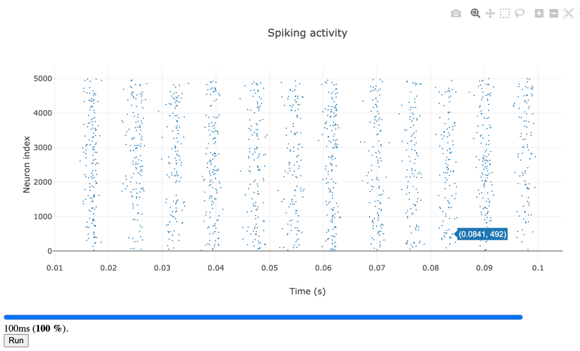

Brunel Hakim 1999
========================

Dynamics of a network of sparsely connected inhibitory current-based integrate-and-fire neurons. Individual neurons fire irregularly at low rate but the network is in an oscillatory global activity regime where neurons are weakly synchronized.

**Reference:**
        “Fast Global Oscillations in Networks of Integrate-and-Fire Neurons with Low Firing Rates” Nicolas Brunel & Vincent Hakim Neural Computation 11, 1621-1671 (1999)

 .. code-block:: python

        // brunel_hakim1999.py
        from brian2 import *

        N = 5000
        Vr = 10*mV
        theta = 20*mV
        tau = 20*ms
        delta = 2*ms
        taurefr = 2*ms
        duration = .1*second
        C = 1000
        sparseness = float(C)/N
        J = .1*mV
        muext = 25*mV
        sigmaext = 1*mV

        eqs = """
        dV/dt = (-V+muext + sigmaext * sqrt(tau) * xi)/tau : volt
        """

        group = NeuronGroup(N, eqs, threshold='V>theta',
                            reset='V=Vr', refractory=taurefr, method='euler')
        group.V = Vr
        conn = Synapses(group, group, on_pre='V += -J', delay=delta)
        conn.connect(p=sparseness)
        M = SpikeMonitor(group)
        LFP = PopulationRateMonitor(group)

        run(duration, report='text', report_period=0.1*second)

 .. code-block:: console

        python - m brian2wasm brunel_hakim1999.py

**Output**

