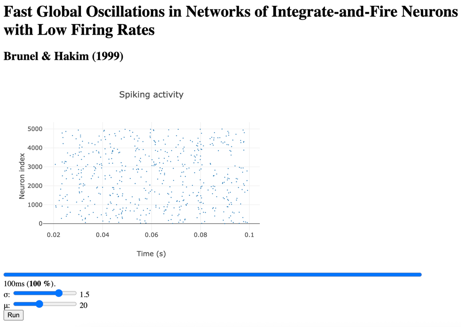

Brunel Hakim 1999 (Interactive Parameters)
========================

This is an interactive version of the Brunel & Hakim (1999) model.
It allows users to change the external input mean (μ) and noise (σ) parameters directly in the browser, and re-run the simulation.

**Reference:**
        “Fast Global Oscillations in Networks of Integrate-and-Fire Neurons with Low Firing Rates” Nicolas Brunel & Vincent Hakim Neural Computation 11, 1621-1671 (1999)

 .. code-block:: python

        // brunel_hakim1999_change_params.py
        from brian2 import *

        N = 5000
        Vr = 10*mV
        theta = 20*mV
        tau = 20*ms
        delta = 2*ms
        taurefr = 2*ms
        duration = .1*second
        C = 1000
        sparseness = float(C)/N
        J = .1*mV
        muext = 25*mV
        sigmaext = 1*mV

        eqs = """
        dV/dt = (-V+muext + sigmaext * sqrt(tau) * xi)/tau : volt
        """

        group = NeuronGroup(N, eqs, threshold='V>theta',
                            reset='V=Vr', refractory=taurefr, method='euler')
        group.V = Vr
        conn = Synapses(group, group, on_pre='V += -J', delay=delta)
        conn.connect(p=sparseness)
        M = SpikeMonitor(group)
        LFP = PopulationRateMonitor(group)

        run(duration, report='text', report_period=0.1*second)

 .. code-block:: html

        <!-- brunel_hakim1999_change_params.html -->
        <!doctype html>
        <html lang="en-us">
        <head>
            <meta charset="utf-8">
            <meta http-equiv="Content-Type" content="text/html; charset=utf-8">
            <title>Brian simulation: Brunel & Hakim (1999)</title>
            
            
            
        </head>
        <body>
        <h1>Fast Global Oscillations in Networks of Integrate-and-Fire Neurons with Low Firing Rates</h1>
        <h2>Brunel & Hakim (1999)</h2>
        

        <progress id="brian_progress_bar" max=1.0 value=0.0 style="width: 90%"></progress>
        

        <label for="sigmaext">σ: </label>
        <input type="range" id="sigmaext"
               min="0" max="2" step="0.1" value="1"
               oninput="this.nextElementSibling.value = this.value">
        <output>1</output>
         
        <label for="muext">μ: </label>
        <input type="range" id="muext"
               min="0" max="50" step="1" value="25"
               oninput="this.nextElementSibling.value = this.value">
        <output>25</output> 
        <button type="button" id='brian_run_button'
                onclick="brian_sim.run({
                'neurongroup.muext': document.getElementById('muext').value/1000,
                'neurongroup.sigmaext': document.getElementById('sigmaext').value/1000
                });">
            Run
        </button>
        </body>
        </html>

 .. code-block:: console

        python - m brian2wasm brunel_hakim1999_change_params.py

**Output**

