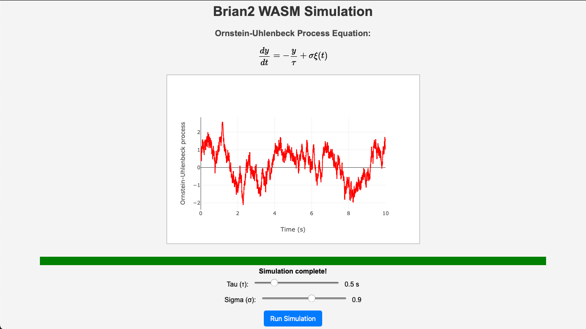

.. brian2wasm documentation master file, created by
   sphinx-quickstart on Sun Aug 10 08:49:52 2025.
   You can adapt this file completely to your liking, but it should at least
   contain the root `toctree` directive.

Welcome to brian2wasm's documentation
========================

The ``brian2wasm`` package is a Brian 2 simulator “device” that compiles Brian models to WebAssembly and JavaScript using the Emscripten tool-chain.

It produces a self-contained web folder (HTML, JavaScript, and .wasm binary) that can run simulations directly in any modern browser.

Please contact us via the
``Brian Discourse group`` (https://brian.discourse.group/)
if you are interested in contributing.

Please report bugs at the `github issue tracker <https://github.com/brian-team/brian2wasm/issues>`_ or in the
``Brian Discourse group`` (https://brian.discourse.group/).

Contents
--------

.. toctree::
   :maxdepth: 2
   :titlesonly:

   release_notes
   user/index
   developer/index
   examples/index

API reference
-------------
.. toctree::
   :maxdepth: 5
   :titlesonly:

   reference/brian2wasm

Indices and tables
------------------

* :ref:`genindex`
* :ref:`modindex`
* :ref:`search`

